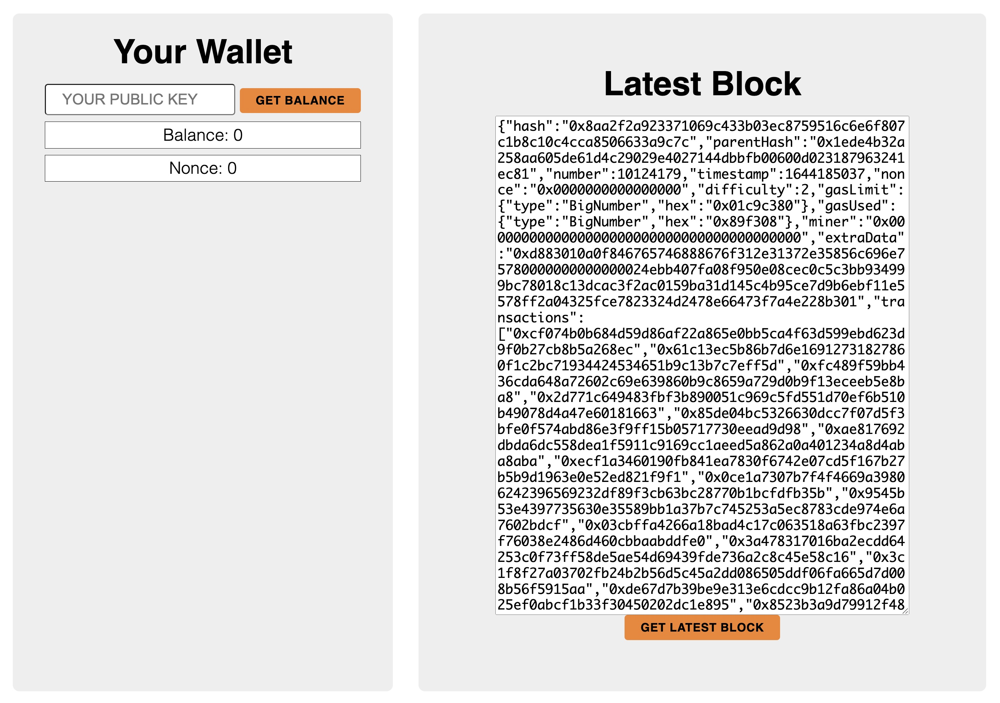
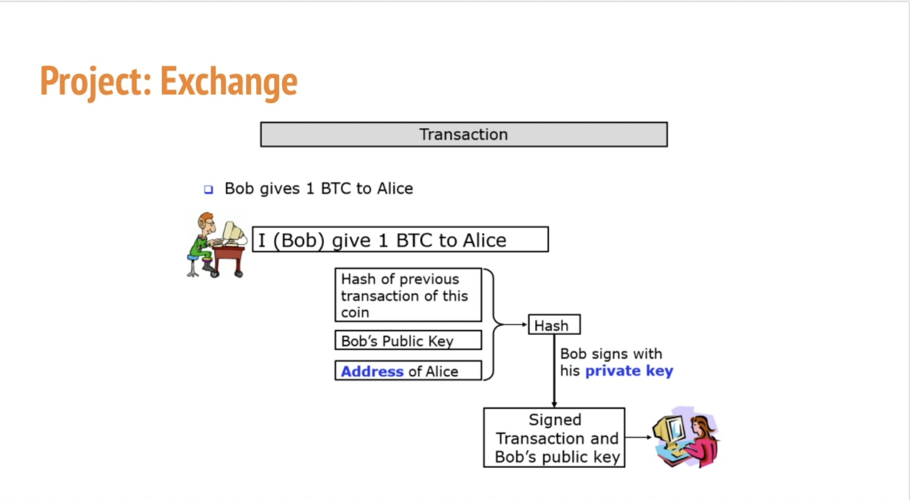

# ECDSA-Exchange
This simple web application takes an array of numbers and then associates them with private and public keys.
Then it allows for exchanging values between the accounts signified by the public and private key pairs.

Instructions:
1. git clone https://github.com/karadikid/ECDSA-Exchange.git
2. cd ECDSA-Exchange
3. npm install
4. cd /server
5. nodemon index.js, note list of public and private keys.
6. cd ../../client
7. npx parcel index.html 
8. Open browser to http://localhost:1234/
9. Enter Public Key for corresponding private key in Wallet Address field
10. Enter private key from 9 in Your Key field
11. Enter amount to transfer in Send amount left field
12. Enter destination public key in right field
13. If private and public keys do not macth verified results report false at console and invalid transaction in balance field

[Instructors Solution](https://github.com/AlvaroLuken/exchange-secp256k1)

